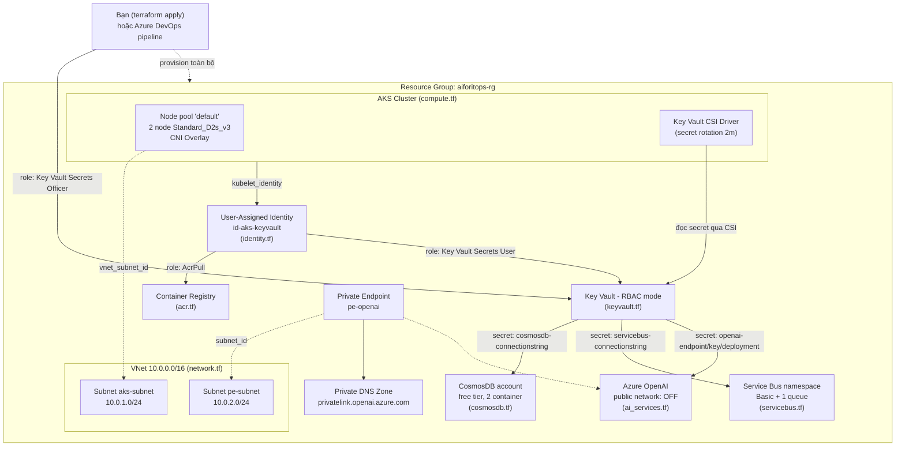
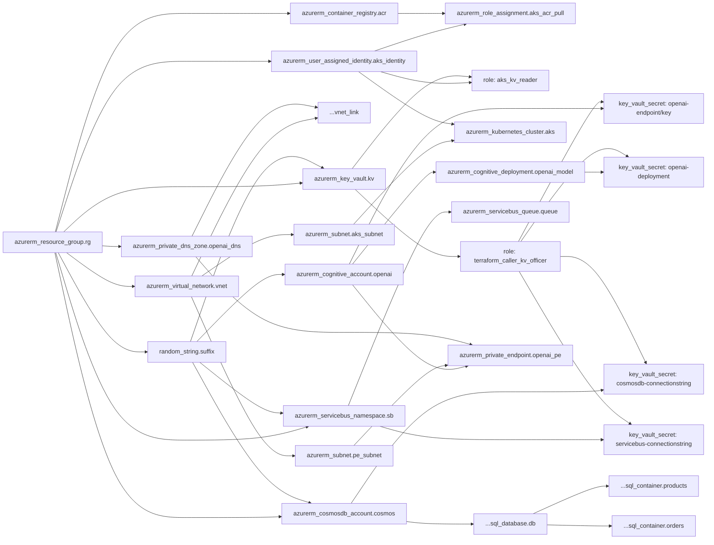
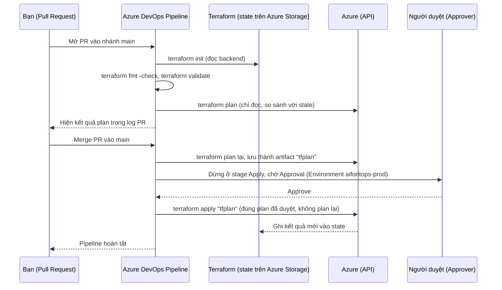

# Giải thích cú pháp Terraform & Kiến trúc — AIforITOps

> Đọc file này sau khi đã làm xong Phase 2 (Terraform cơ bản) trong [../LO-TRINH-HOC-AZURE-TERRAFORM.md](../LO-TRINH-HOC-AZURE-TERRAFORM.md). Mục tiêu: hiểu **từng dòng cú pháp** đang dùng trong folder `terraform/` này, và hiểu **bức tranh kiến trúc tổng thể**.

---

## Phần 1 — Cú pháp HCL (HashiCorp Configuration Language) cơ bản

Terraform dùng ngôn ngữ HCL. Toàn bộ file `.tf` trong project chỉ dùng 6 loại "block" sau:

| Block | Dùng để | Ví dụ trong project |
|---|---|---|
| `terraform { }` | Khai báo version, provider cần dùng, nơi lưu state | [providers.tf](providers.tf) |
| `provider "x" { }` | Cấu hình cách kết nối tới Azure | [providers.tf](providers.tf) |
| `resource "TYPE" "NAME" { }` | **Tạo** 1 resource thật trên Azure | hầu hết các file |
| `data "TYPE" "NAME" { }` | **Đọc** thông tin có sẵn (không tạo mới) | `data.azurerm_client_config.current` |
| `variable "x" { }` | Khai báo input, có thể override lúc chạy | [variables.tf](variables.tf) |
| `output "x" { }` | In ra giá trị sau khi apply xong | [outputs.tf](outputs.tf) |

### 1.1 `resource "TYPE" "NAME"` — cú pháp quan trọng nhất

```hcl
resource "azurerm_resource_group" "rg" {
  name     = var.resource_group_name
  location = var.location
}
```

- `azurerm_resource_group` — **TYPE**: loại resource, do provider `azurerm` định nghĩa sẵn (không tự đặt tên được). Muốn biết 1 resource type có field gì, tra [Terraform Registry — azurerm docs](https://registry.terraform.io/providers/hashicorp/azurerm/latest/docs).
- `"rg"` — **local name**: tên bạn tự đặt, chỉ dùng để tham chiếu **bên trong code Terraform**, KHÔNG phải tên resource thật trên Azure (tên thật nằm trong field `name = ...`).
- Muốn tham chiếu lại resource này ở file khác, viết `azurerm_resource_group.rg.<field>`, ví dụ `azurerm_resource_group.rg.name`, `azurerm_resource_group.rg.location`, `azurerm_resource_group.rg.id`.

Đây chính là cách các file trong project nối với nhau. Ví dụ trong [acr.tf](acr.tf):

```hcl
resource "azurerm_container_registry" "acr" {
  location            = azurerm_resource_group.rg.location   # <- tham chiếu sang main.tf
  resource_group_name = azurerm_resource_group.rg.name       # <- tham chiếu sang main.tf
  ...
}
```

Khi bạn viết `azurerm_resource_group.rg.location`, Terraform tự hiểu: **"acr" phải được tạo SAU "rg"** — đây gọi là **implicit dependency** (phụ thuộc ngầm). Bạn không cần tự khai báo thứ tự tạo resource, Terraform tự dựng "dependency graph" (xem Phần 3) từ các tham chiếu này.

### 1.2 String interpolation — `"${...}"`

```hcl
name = "${var.acr_name}${random_string.suffix.result}"
```

Bất kỳ chỗ nào có `${ }` bên trong chuỗi `"..."`, Terraform sẽ chạy biểu thức bên trong rồi nối vào chuỗi. Ở đây: lấy giá trị biến `acr_name` (vd "aiforitopsacr") nối với 5 ký tự random (vd "x7k2p") → ra `"aiforitopsacrx7k2p"`. Lý do phải làm vậy: tên ACR/KeyVault/CosmosDB/OpenAI/ServiceBus phải **unique trên toàn Azure**, nếu để tên cố định thì người thứ 2 chạy `terraform apply` với cùng tên sẽ bị lỗi trùng.

### 1.3 `variable` — input có thể thay đổi khi chạy

```hcl
variable "location" {
  type        = string
  description = "Vùng (region) triển khai cho hầu hết resource"
  default     = "japaneast"
}
```

- `type` — kiểu dữ liệu: `string`, `number`, `bool`, `list(string)`, `map(string)`, `object({...})`.
- `default` — giá trị dùng nếu bạn không truyền gì khác. Cách override (theo thứ tự ưu tiên tăng dần):
  1. `default` trong `variable` block (thấp nhất)
  2. file `terraform.tfvars` (tự động đọc nếu tồn tại)
  3. `-var-file=xxx.tfvars` truyền tay
  4. `-var="location=eastus"` truyền tay trên command line (cao nhất)
- Dùng lại ở nơi khác bằng `var.location`.

### 1.4 `data` — đọc thông tin có sẵn, không tạo gì cả

```hcl
data "azurerm_client_config" "current" {}
```

Khác với `resource` (tạo mới), `data` chỉ **đọc**. Ở đây nó đọc thông tin về **danh tính đang chạy `terraform apply`** (chính bạn nếu chạy local, hoặc service principal nếu chạy trong pipeline). Dùng ở [keyvault.tf](keyvault.tf):

```hcl
resource "azurerm_role_assignment" "terraform_caller_kv_officer" {
  principal_id = data.azurerm_client_config.current.object_id
}
```

→ Tự động cấp quyền ghi Key Vault cho **bất kỳ ai/cái gì** đang chạy Terraform, không cần biết trước đó là ai.

### 1.5 `count` — tạo 0 hoặc nhiều resource có điều kiện

```hcl
variable "principal_id" {
  default = ""
}

resource "azurerm_role_assignment" "user_kv_officer" {
  count = var.principal_id != "" ? 1 : 0
  ...
  principal_id = var.principal_id
}
```

`count` nhận 1 số nguyên: 0 = không tạo resource này, N = tạo N bản sao (đánh số `[0]`, `[1]`...). Ở đây dùng kiểu "if": nếu bạn có set `principal_id` thì tạo 1 role assignment, nếu để trống (`""`) thì bỏ qua. Đây là toán tử 3 ngôi quen thuộc: `điều_kiện ? giá_trị_nếu_đúng : giá_trị_nếu_sai`.

### 1.6 `depends_on` — phụ thuộc tường minh

```hcl
resource "azurerm_key_vault_secret" "cosmosdb_connectionstring" {
  ...
  depends_on = [azurerm_role_assignment.terraform_caller_kv_officer]
}
```

Bình thường Terraform tự suy ra thứ tự qua tham chiếu (mục 1.1). Nhưng ở đây, việc "ghi được secret" phụ thuộc vào role assignment đã **có hiệu lực thật sự trên Azure AD** (không chỉ là đã gọi API tạo xong) — một quan hệ mà Terraform không tự nhìn thấy qua tham chiếu field. `depends_on` ép buộc: chờ role assignment xong hẳn rồi mới thử ghi secret.

### 1.7 Nested block vs attribute — 2 cách khai báo khác nhau trong CÙNG 1 resource

```hcl
resource "azurerm_kubernetes_cluster" "aks" {
  name     = var.aks_name          # <- ATTRIBUTE: key = value
  sku_tier = var.aks_sku_tier      # <- ATTRIBUTE

  default_node_pool {              # <- NESTED BLOCK: không có dấu =
    name       = "default"
    node_count = var.aks_node_count
  }

  identity {                       # <- NESTED BLOCK khác
    type         = "UserAssigned"
    identity_ids = [azurerm_user_assigned_identity.aks_identity.id]
  }
}
```

Cách phân biệt: **attribute** dùng `key = value` (1 giá trị đơn/list/map). **Nested block** là `tên_block { ... }` không có dấu `=`, dùng khi 1 resource có 1 nhóm cấu hình con phức tạp (ví dụ AKS có `default_node_pool`, `identity`, `network_profile`, `key_vault_secrets_provider` — mỗi cái là 1 "cụm" field riêng). Đây là chỗ dễ gõ sai nhất khi mới học — quên dấu `{}` hoặc thêm nhầm dấu `=` sẽ báo lỗi ngay ở `terraform validate`.

### 1.8 `sensitive` — che giá trị nhạy cảm khỏi log/output

Terraform tự động đánh dấu `sensitive = true` cho một số attribute do chính provider `azurerm` quy định (ví dụ `azurerm_servicebus_namespace.default_primary_connection_string`, `azurerm_cognitive_account.primary_access_key`). Khi bạn chạy `terraform plan`, các giá trị này sẽ hiện `(sensitive value)` thay vì in ra thật — nhưng chúng **vẫn được lưu dạng plain text trong file state** (`.tfstate`). Đây là lý do bắt buộc:
- Không bao giờ commit `.tfstate` lên git (đã chặn ở `.gitignore` gốc).
- Dùng remote backend (Azure Storage) để state được mã hoá at-rest và giới hạn quyền truy cập, thay vì nằm trên máy local.

### 1.9 Tóm tắt vòng đời lệnh

| Lệnh | Làm gì | Có động tới Azure thật không |
|---|---|---|
| `terraform init` | Tải provider, cấu hình backend | Không |
| `terraform validate` | Kiểm tra cú pháp/kiểu dữ liệu | Không |
| `terraform fmt` | Format lại code cho đẹp | Không |
| `terraform plan` | Tính toán sẽ tạo/sửa/xoá gì (so với state) | Chỉ đọc (read-only API calls) |
| `terraform apply` | Thực thi đúng như plan | **Có** — tạo/sửa/xoá resource thật |
| `terraform destroy` | Xoá toàn bộ resource đang quản lý trong state | **Có** — xoá thật |

---

## Phần 2 — Kiến trúc tổng thể



**Đọc sơ đồ này như thế nào:**
- Đường nét liền có nhãn "role: ..." = một `azurerm_role_assignment` (RBAC) — quyền, không phải kết nối mạng.
- Đường nét đứt `-.->` = quan hệ hạ tầng mạng (subnet, private endpoint, DNS).
- 3 mũi tên "secret: ..." từ KV ra Cosmos/ServiceBus/OpenAI thực ra đi **ngược chiều dữ liệu**: Terraform đọc connection string/key từ Cosmos/ServiceBus/OpenAI rồi **ghi vào** Key Vault ([keyvault-secrets.tf](keyvault-secrets.tf)) — vẽ theo chiều "KV chứa thông tin của" cho dễ hình dung.
- Ứng dụng (AdminSite/StoreFront/ProductWorker chạy trong pod AKS, xem [../k8s/](../k8s/)) sẽ đọc secret ngược lại từ KV qua CSI Driver, không tự gọi trực tiếp Cosmos/ServiceBus bằng key hard-code.

---

## Phần 3 — Thứ tự Terraform thực sự tạo resource (dependency graph)

Đây là thứ tự Terraform tự suy ra được từ các tham chiếu (mục 1.1), **không phải thứ tự các file `.tf` bạn viết** — Terraform đọc TẤT CẢ file `.tf` trong folder cùng lúc rồi tự dựng graph, thứ tự file/tên file không quan trọng.



**Ý nghĩa thực tế:** khi bạn chạy `terraform apply`, các nhánh KHÔNG phụ thuộc nhau (vd `ACR`, `KV`, `COSMOS`, `SB`, `OAI` đều chỉ phụ thuộc `RG`) sẽ được Terraform **tạo song song** để nhanh hơn — đây là lý do dùng IaC nhanh hơn hẳn so với chạy tuần tự từng lệnh `az cli` bằng tay như ở Phase 1 của lộ trình học.

---

## Phần 4 — Luồng Azure DevOps Pipeline



Điểm quan trọng: **stage Apply dùng đúng file `tfplan` đã tạo ở stage Plan** (`terraform apply tfplan`, không phải `terraform apply` chay) — đảm bảo những gì người duyệt nhìn thấy lúc Approve chính xác là những gì sẽ được thực thi, không có khoảng trống để hạ tầng đổi khác giữa lúc plan và lúc apply.

---

## Câu hỏi tự kiểm tra (đừng đọc đáp án trước)

1. Nếu xoá dòng `location = azurerm_resource_group.rg.location` trong `acr.tf` và thay bằng `location = "japaneast"` (hard-code), Terraform còn biết phải tạo `rg` trước `acr` không? Vì sao?
2. `count = var.principal_id != "" ? 1 : 0` — nếu `principal_id` có giá trị, muốn tham chiếu tới resource đó ở nơi khác phải viết thế nào (gợi ý: khác với resource không có `count`)?
3. Trong sơ đồ Phần 3, vì sao `azurerm_key_vault_secret.cosmosdb_connectionstring` phải phụ thuộc cả `COSMOS` lẫn `KVROLE2`, thiếu 1 trong 2 thì `terraform apply` sẽ lỗi ở bước nào?

<details>
<summary>Gợi ý đáp án</summary>

1. Vẫn biết — vì `resource_group_name = azurerm_resource_group.rg.name` ở dòng khác trong cùng resource vẫn còn tham chiếu, chỉ cần 1 tham chiếu là đủ để Terraform dựng dependency. Nhưng đây là lý do KHÔNG nên hard-code bất kỳ field nào có thể tham chiếu được — mất tham chiếu ở tất cả field mới thực sự mất dependency.
2. `azurerm_role_assignment.user_kv_officer[0]` — vì có `count`, resource trở thành 1 danh sách (list), phải chỉ định index.
3. Thiếu `COSMOS` → lỗi vì chưa có connection string để đọc (giá trị chưa tồn tại). Thiếu `KVROLE2` → lỗi 403 Forbidden vì danh tính chạy Terraform chưa có quyền ghi secret vào Key Vault.

</details>
